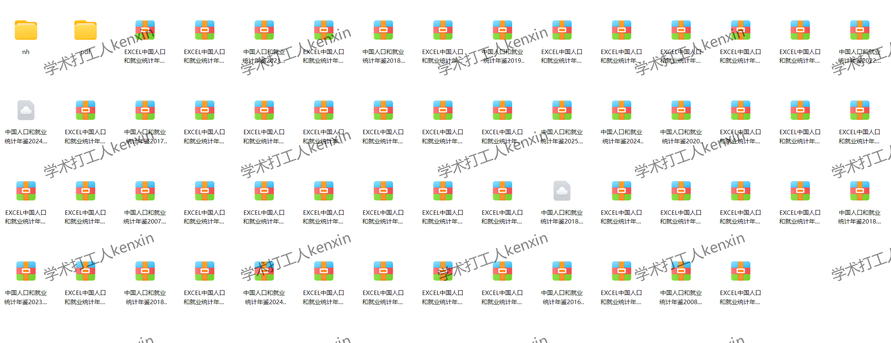
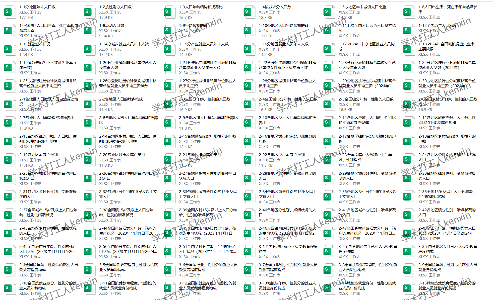
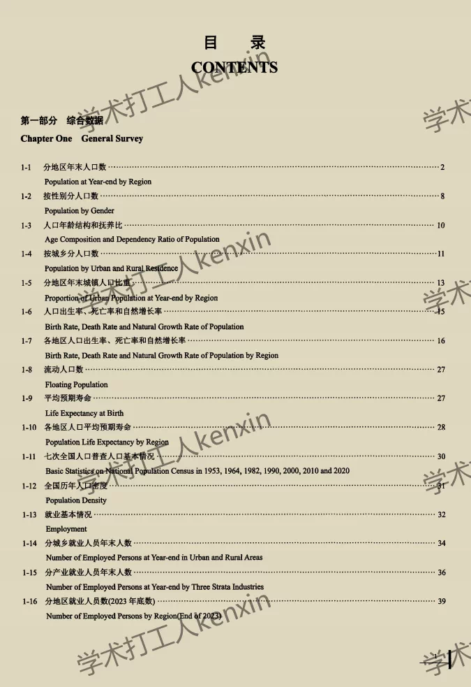
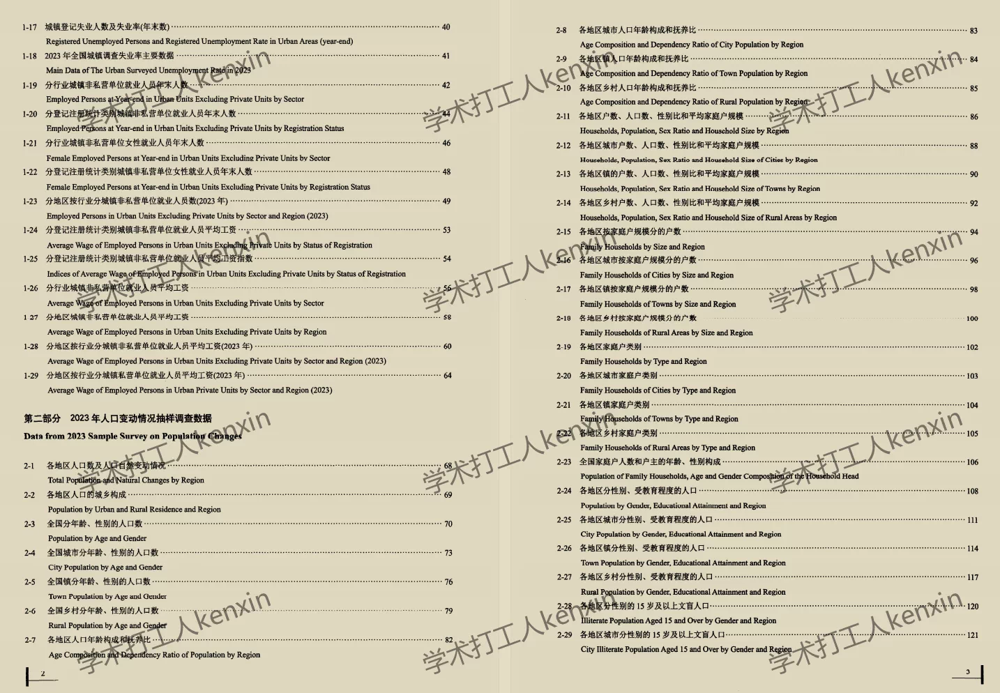
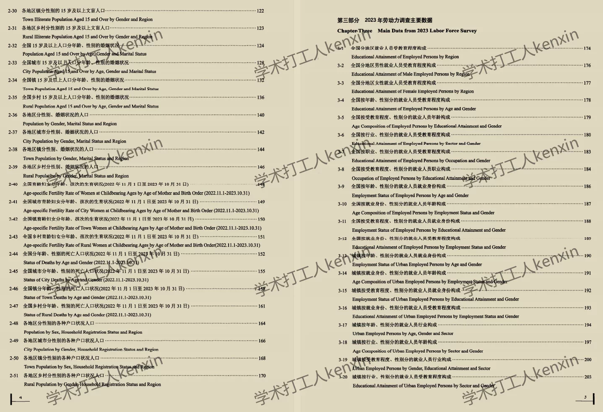
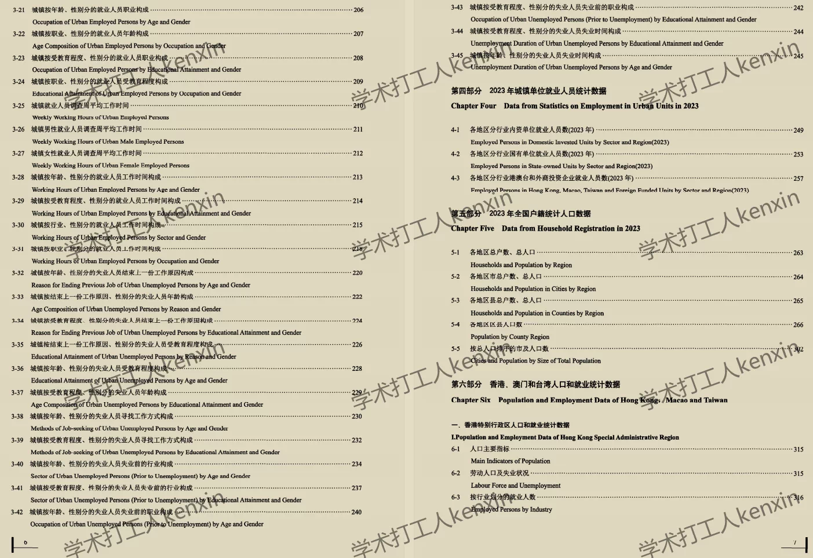
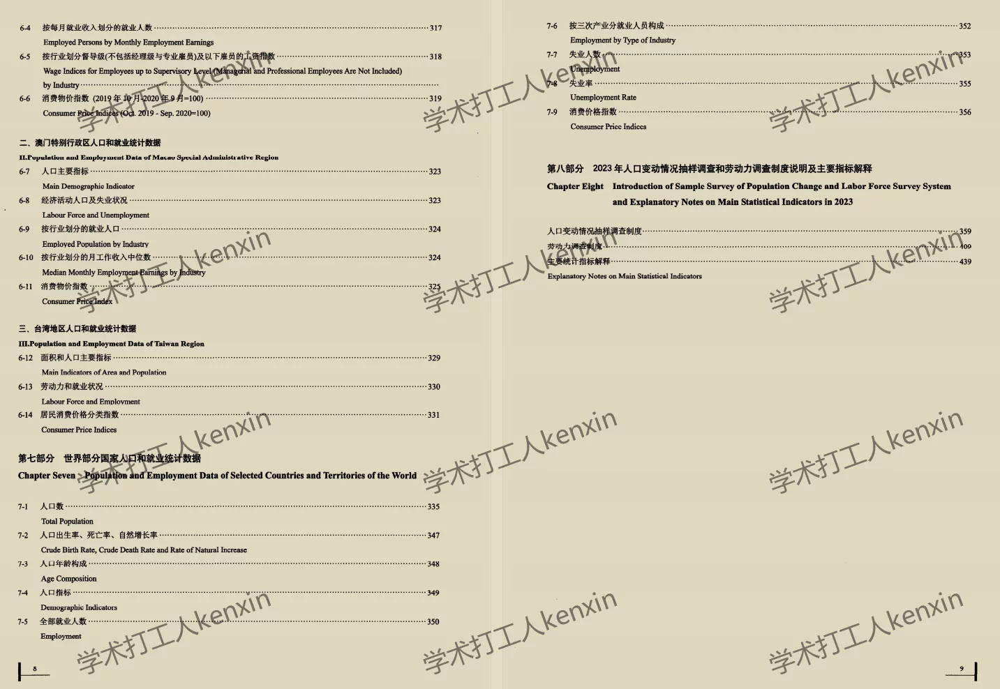

## Body

《中国人口与就业统计年鉴》（1988-2025年）

Data Introduction:
The "China Population and Employment Statistical Yearbook" (1988-2025)

Indicator Details:
(1) The directory is displayed in the image, please take a look on your own. You can purchase based on your needs. If you need help finding specific indicators, they are all here. After shipping, there will be no returns or exchanges without any reason.
(2) The display directory is for 2024, due to the limited space, only some of them are shown. The statistical methods may change from year to year. Academic common sense, the data year recorded in statistical materials is the previous year's data, which is also an academic common sense. Please be aware of this.
(3) The Excel format data is organized from original materials, including the content of the original data but not the text content.
(4) If the material is placed in a zip file, you need to save it first, then download, and then extract.
(5) If there is Excel protection, you can select all and copy to a new sheet to use.

Data Format:
The format varies by year, so I won't count the different formats. If you have any concerns, please do not buy.
Only Excel format available for 2025.

## Images

item_1072594168202

Here is a pay link on Stripe ( https://buy.stripe.com/3cs8yP7sY87d0vu9AB ). Please contact me lonlonago@foxmail.com after funding $89, and I will send you a complete data files , thank you!

